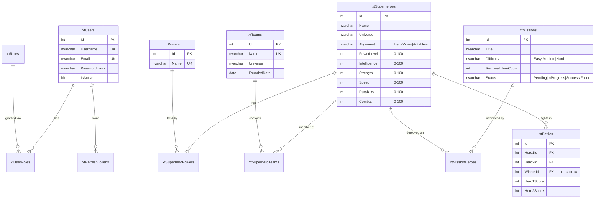
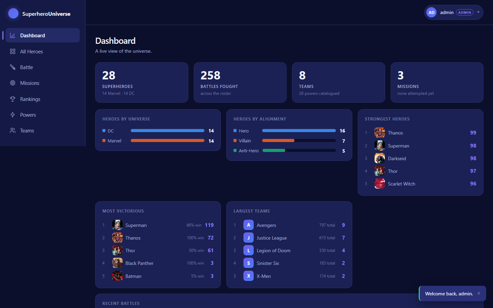
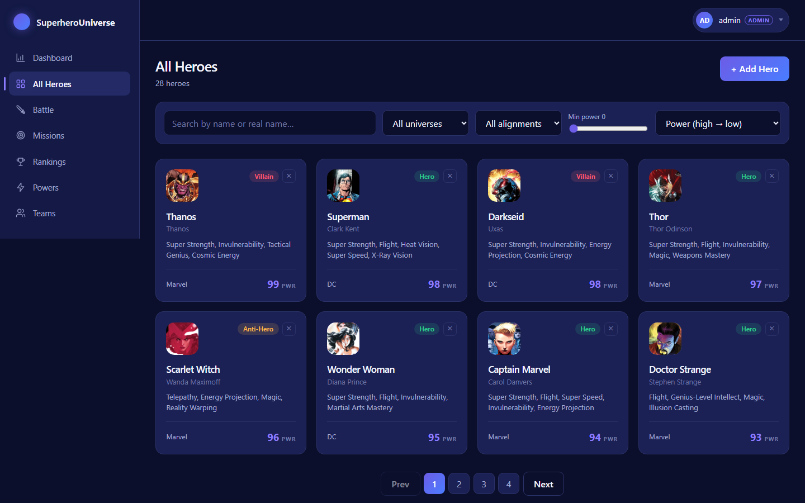
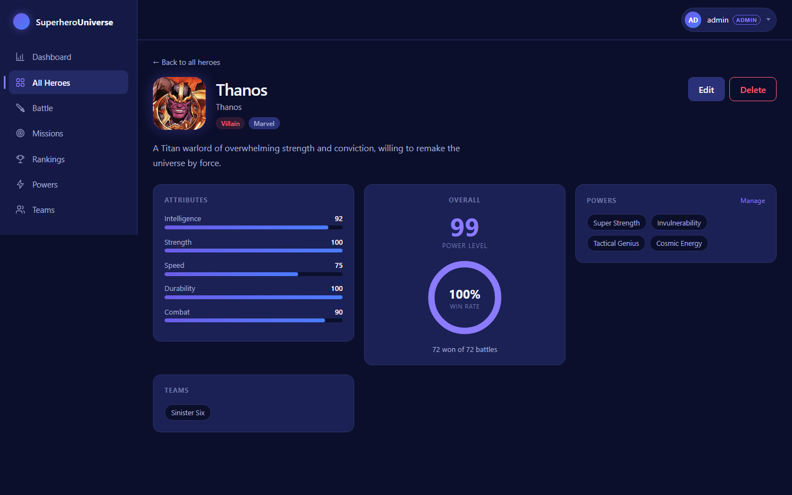
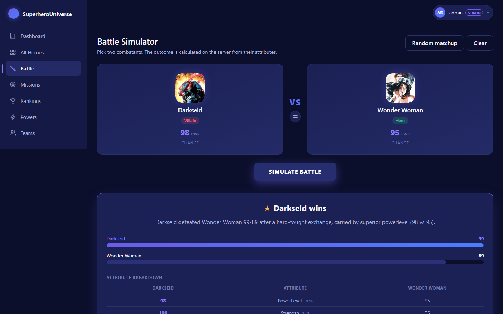
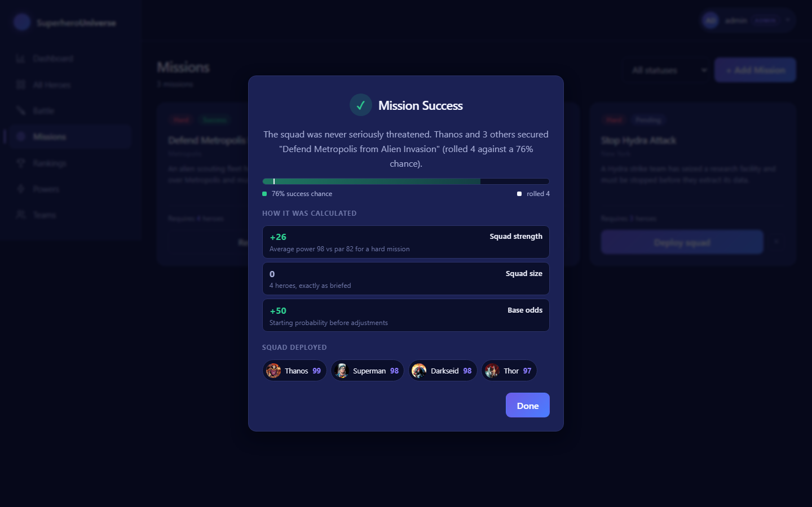
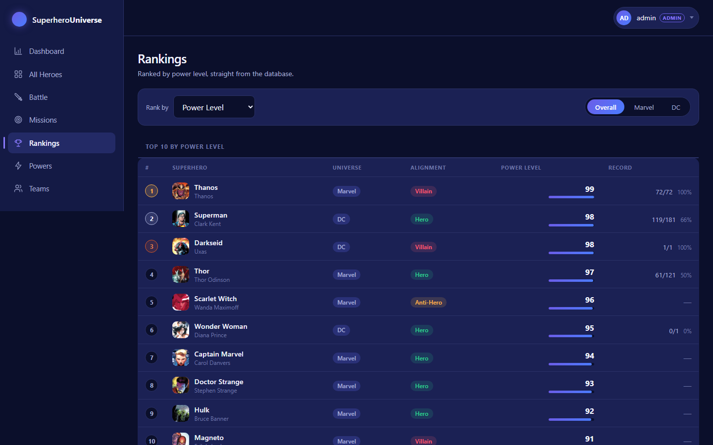

# Superhero Universe Management System

[](https://github.com/rishabhsrivastava10/superhero-universe/actions/workflows/ci.yml)

A full-stack application for managing a comic-book universe: heroes and their powers, teams,
missions, and a battle simulator whose outcomes are computed and stored on the server.

Built as a portfolio project to demonstrate the practices expected of a mid-level engineer —
relational design, a layered API, JWT authentication with role-based authorization, meaningful
tests, and a CI pipeline that actually gates merges.

**Stack:** Angular 22 · ASP.NET Core (.NET 10) · Entity Framework Core · SQL Server

---

## Table of contents

- [The problem it solves](#the-problem-it-solves)
- [Features](#features)
- [Architecture](#architecture)
- [Tech stack](#tech-stack)
- [Repository structure](#repository-structure)
- [Database](#database)
- [API reference](#api-reference)
- [Screens](#screens)
- [Running it locally](#running-it-locally)
- [Configuration and secrets](#configuration-and-secrets)
- [Testing](#testing)
- [CI/CD](#cicd)
- [Design decisions worth explaining](#design-decisions-worth-explaining)
- [Not done yet](#not-done-yet)

---

## The problem it solves

A comic universe is a genuinely relational domain, which makes it a better vehicle for
demonstrating engineering than another to-do list:

- **Many-to-many everywhere** — a hero has many powers and belongs to many teams; a team has many
  heroes; a mission is attempted by a squad.
- **Rules that must live on the server** — a battle result or a mission's success probability
  cannot be computed in the browser, because a user with devtools open could simply change it.
- **A permission boundary** — anyone signed in can browse and simulate; only administrators can
  change the roster.
- **Referential decisions with real consequences** — deleting a hero who has fought battles is
  refused rather than cascaded, because battle history is a permanent record.

## Features

**Everyone signed in**
- Browse heroes with server-side search, filtering (universe, alignment, minimum power), sorting
  and pagination
- Hero detail with attribute bars, powers, teams and a win-rate ring
- Simulate battles between any two heroes, with a per-attribute breakdown of the result
- Deploy a squad on a mission and see exactly why it succeeded or failed
- Dashboard of live aggregates, and rankings by any of seven attributes across Overall/Marvel/DC

**Administrators additionally**
- Full CRUD for heroes, powers, teams and missions
- Assign powers to a hero and manage team membership
- Reset a completed mission so it can be attempted again

## Architecture

```
┌─────────────────────────┐         ┌──────────────────────────────┐        ┌────────────┐
│  Angular 22 SPA         │  HTTPS  │  ASP.NET Core Web API        │  EF    │ SQL Server │
│  standalone components  │ ──────► │  Controllers → Services → EF │ ─────► │ 12 tables  │
│  signals + RxJS         │  JWT    │  business logic lives here   │  Core  │            │
└─────────────────────────┘         └──────────────────────────────┘        └────────────┘
```

A **modular monolith**, not microservices — the right call at this scale, and the layering is
internal:

| Project | Responsibility |
|---|---|
| `WebAPISuperheroUniverse.API` | Controllers, services, middleware, validators |
| `WebAPISuperheroUniverse.DBContext` | `AppDbContext` and EF Core migrations |
| `WebAPISuperheroUniverse.Entities` | Entity classes, DTOs, enums — no dependencies |
| `CommonAPI` | JWT issuing/validation and password hashing, shared across API projects |

Dependencies point one way: **API → DBContext → Entities**.

Controllers stay thin — they parse the request, call a service, and map the outcome to a status
code. Services return an outcome enum rather than throwing, because "hero not found" and "name
already taken" are ordinary results, not exceptional conditions.

## Tech stack

| Layer | Choice |
|---|---|
| Frontend | Angular 22, standalone components, signals, RxJS, Reactive Forms, SCSS |
| Backend | ASP.NET Core on .NET 10, C# |
| Data | Entity Framework Core 10, SQL Server 2025 |
| Auth | JWT access tokens + rotating refresh tokens, BCrypt (work factor 12) |
| Validation | FluentValidation, applied via a global action filter |
| Logging | Serilog — console + rolling file |
| API docs | Swagger / OpenAPI (Swashbuckle) |
| Tests | xUnit + Moq, Vitest, PowerShell integration suites |
| CI | GitHub Actions |

## Repository structure

One repository, organised by technology — mirroring how the author's workplace separates them:

```
├── .github/workflows/       CI pipeline and its documentation
├── global.json              pins the .NET SDK for local and CI alike
│
├── Angular/angular-22-learning/
│   ├── src/                 thin shell app: providers, interceptors, routes
│   └── libs/
│       ├── superhero-universe/   the entire front end (core, shared, features, layout)
│       └── common-ui/            reserved for genuinely app-agnostic components
│
├── Dot Net/DotNetCoreAPI/
│   ├── CommonAPI/                JWT + password hashing, shared
│   └── WebAPISuperheroUniverse/
│       ├── WebAPISuperheroUniverse.sln
│       ├── IntegrationTests/     PowerShell API suites + runner
│       └── WebAPISuperheroUniverse/
│           ├── API/ DBContext/ Entities/ Tests/
│
└── SQL/DB/
    ├── Tables/              original hand-written schema + the generated deploy script
    ├── DataScripts/         idempotent seed data
    └── StoredProcedures/    (none yet)
```

Naming follows a consistent convention: `xt` prefix for tables, `xsp` for stored procedures,
`Cls`/`Model`/`Enum` prefixes for C# classes, DTOs and enums.

## Database

12 tables, 12 foreign keys, 11 check constraints, 32 indexes, 7 default constraints.



**Schema ownership:** EF Core migrations are authoritative; the SQL deployment script is
*generated* from them, never hand-maintained. See [`SQL/DB/README.md`](SQL/DB/README.md) for the
reasoning and the change workflow.

Constraints are enforced at the database level as well as in the API — every attribute has a
`CHECK (BETWEEN 0 AND 100)`, alignment and difficulty are constrained enumerations, and
`CK_xtBattles_DistinctHeroes` makes it impossible to store a hero fighting itself.

## API reference

Full interactive documentation is at **`/swagger`** when running in Development.

| Method | Route | Access |
|---|---|---|
| POST | `/api/auth/register` · `/login` · `/refresh` | Anonymous |
| POST | `/api/auth/logout` | Authenticated |
| GET | `/api/auth/me` | Authenticated |
| GET | `/api/superheroes` *(page, pageSize, search, universe, alignment, minPowerLevel, maxPowerLevel, sortBy, sortDir)* | Authenticated |
| GET | `/api/superheroes/{id}` | Authenticated |
| POST / PUT / DELETE | `/api/superheroes` · `/{id}` | **Admin** |
| PUT | `/api/superheroes/{id}/powers` | **Admin** |
| GET | `/api/powers` · `/{id}` | Authenticated |
| POST / PUT / DELETE | `/api/powers` · `/{id}` | **Admin** |
| GET | `/api/teams` *(universe)* · `/{id}` | Authenticated |
| POST / PUT / DELETE | `/api/teams` · `/{id}` | **Admin** |
| POST / DELETE | `/api/teams/{id}/members` · `/members/{superheroId}` | **Admin** |
| POST | `/api/battles/simulate` | Authenticated |
| GET | `/api/battles` *(page, pageSize, superheroId)* · `/{id}` | Authenticated |
| GET | `/api/missions` *(status)* · `/{id}` | Authenticated |
| POST | `/api/missions/{id}/start` | Authenticated |
| POST / PUT / DELETE | `/api/missions` · `/{id}` · `/{id}/reset` | **Admin** |
| GET | `/api/dashboard` | Authenticated |
| GET | `/api/rankings` *(sortBy, take)* | Authenticated |

Status codes are used deliberately: `201` with a `Location` header on creation, `409` for a
genuine conflict (duplicate name, deleting a hero with battle history, re-running a resolved
mission), `401` for "who are you" versus `403` for "you may not".

Every failure returns the same shape, so the client handles errors generically:

```json
{
  "statusCode": 400,
  "message": "One or more validation errors occurred.",
  "timestamp": "2026-08-15T13:06:35.9367208Z",
  "errors": { "Hero2Id": ["A superhero cannot battle themselves."] }
}
```

## Screens

### Dashboard

Live aggregates — every figure is computed from the database on request, not stored.



### Hero list

Server-side search, filtering, sorting and paging. Typing is debounced, so a search sends one
request rather than one per keystroke.



### Hero detail

Attributes, powers, teams and a battle record — several many-to-many relationships in one view.



### Battle simulator

The browser sends two hero IDs and nothing else; the server computes the result and stores it.
The breakdown shows which attribute proved decisive.



### Mission outcome

The success probability, the roll against it, and each contributing factor — the result is
explained rather than merely announced.



### Rankings

Sortable by seven attributes, across Overall / Marvel / DC.



Also included: login and registration, missions list, squad deployment, powers catalogue, team
list and team detail — all 15 screens are in
[`Documentation/screenshots/`](Documentation/screenshots/).

> A Word walkthrough (`Documentation/Superhero Universe - Project Walkthrough.docx`) steps through
> every screen with an explanation of what happens behind it. It is **not committed** — it is a
> 1.7 MB binary that git cannot diff, and it is reproducible from the tracked screenshots above.

## Running it locally

**Prerequisites:** .NET 10 SDK · Node.js 22+ · SQL Server (Developer Edition is fine)

### 1. Database

Run the deployment script, then the seed scripts, against your SQL Server instance:

```powershell
sqlcmd -S localhost -E -Q "CREATE DATABASE SuperheroUniverseDb"
sqlcmd -S localhost -E -d SuperheroUniverseDb -i "SQL\DB\Tables\SuperheroUniverse\_GeneratedFromEfMigrations\SuperheroUniverseDb_Schema.sql"

cd SQL\DB\DataScripts\SuperheroUniverse
# 10_RunAllSeed is an sqlcmd-mode wrapper that includes 01-09, and 11_Baseline applies only to a
# database built from the older hand-written scripts - the generated schema above already records
# the migration. Both are skipped here.
Get-ChildItem *.sql |
  Where-Object { $_.Name -notmatch '^(10_RunAllSeed|11_BaselineEfMigrationHistory)' } |
  Sort-Object Name |
  ForEach-Object { sqlcmd -S localhost -E -i $_.FullName }
```

Every seed script is idempotent, so re-running them inserts nothing twice.

### 2. API

```powershell
cd "Dot Net\DotNetCoreAPI\WebAPISuperheroUniverse\WebAPISuperheroUniverse\API"
dotnet user-secrets set "Jwt:Key" "<any string of at least 32 characters>"
dotnet run
```

The API refuses to start without a signing key — that is deliberate, so it can never run with a
weak or absent one.

`dotnet run` uses the first launch profile, so Swagger is at **`http://localhost:5024/swagger`**.
Use `dotnet run --launch-profile https` for `https://localhost:7162` instead.

Alternatively, publish once and run it standalone (handy while working on the front end):

```powershell
cd "Dot Net\DotNetCoreAPI\WebAPISuperheroUniverse"
dotnet publish WebAPISuperheroUniverse\API\WebAPISuperheroUniverse.API.csproj -c Release -o Publish
.\start-api.ps1        # http://localhost:5024
```

### 3. Front end

```powershell
cd Angular\angular-22-learning
npm ci
npx ng serve            # http://localhost:4200
```

### 4. Sign in

Seeded development administrator: **`admin` / `Admin@12345`**

Or register a new account — self-registration always grants the `User` role, never `Admin`.

## Configuration and secrets

| Setting | Where | Notes |
|---|---|---|
| `ConnectionStrings:DefaultConnection` | `appsettings.json` | Local trusted connection by default |
| `Jwt:Key` | **user secrets** / `JWT__KEY` env var | Never committed; startup fails without ≥32 chars |
| `Jwt:Issuer` / `Audience` | `appsettings.json` | |
| `Jwt:AccessTokenMinutes` | `appsettings.json` | 15 |
| `Jwt:RefreshTokenDays` | `appsettings.json` | 7 |
| `Cors:AllowedOrigins` | `appsettings.json` | `http://localhost:4200` |
| `apiBaseUrl` | `src/environments/environment.ts` | Front-end target |

No secret is committed to this repository.

## Testing

**365 assertions across three layers.**

| Layer | Count | Command |
|---|---|---|
| Unit (xUnit) | 111 | `dotnet test "Dot Net/DotNetCoreAPI/WebAPISuperheroUniverse/WebAPISuperheroUniverse.sln"` |
| Frontend (Vitest) | 20 | `npx ng test superhero-universe --watch=false` |
| API integration | 234 | `.\Dot Net\DotNetCoreAPI\WebAPISuperheroUniverse\IntegrationTests\Run-All.ps1` |

The unit tests are pure — no database, no HTTP — because the randomness in the battle and mission
algorithms is injected behind an interface. That makes probabilistic logic assertable exactly:

```csharp
// Weights sum to 1.0, so a hero whose attributes are all 70 must score exactly 70.
var result = new ClsBattleCalculator(new ClsFixedVarianceProvider(1.0))
    .Simulate(FlatHero(70), FlatHero(40));
Assert.Equal(70, result.Hero1Score);
```

The integration suites drive the real HTTP API against a seeded database, covering routing,
authorization, EF Core translation and the database's own constraints. They need the API running.

## CI/CD

Every push and pull request to `main` runs two jobs in parallel — backend (restore → build → test)
and frontend (`npm ci` → build → test). Both must pass; a branch ruleset makes them **required**,
so a red pipeline blocks the merge rather than merely reporting.

Details, and what is deliberately excluded, are in
[`.github/workflows/README.md`](.github/workflows/README.md).

## Design decisions worth explaining

**Battle logic lives on the server.** The client submits two ids and renders whatever comes back.
A browser-side implementation would be editable by anyone with devtools.

**Randomness is injected, not called inline.** `IBattleVarianceProvider` and `IMissionRollProvider`
exist so tests can pin an exact outcome. Calling `Random` inside the calculators would have made
the core business logic untestable.

**Mission odds use average squad power, not total.** With totals, adding any weak hero always
helps and a crowd beats a hand-picked elite pair. Average makes squad *quality* matter, while a
separate term handles size.

**Deleting a hero with battle history returns 409.** The three foreign keys from `xtBattles` are
`NO ACTION` (SQL Server refuses converging cascade paths anyway), so the service checks first and
explains why rather than surfacing a constraint violation as a 500.

**Re-running a resolved mission returns 409.** Silently overwriting the outcome would mean the
same question gives different answers; an administrator resets it explicitly instead.

**Pagination always has a tie-breaker.** Sorting by a non-unique column has no guaranteed row
order, so the same record can appear on two pages. Every sort ends `.ThenBy(h => h.Id)`.

**Chart colours were validated, not chosen by eye.** The app's semantic green/red/amber failed a
colour-vision check (deuteranopia ΔE 5.3 between red and green), so chart marks use a validated
categorical palette and every bar carries a text label.

## Not done yet

Stated plainly rather than implied:

- **No Docker.** There is no `Dockerfile` or `docker-compose.yml`. Running the app requires a
  local SQL Server, .NET SDK and Node.
- **No deployment.** Nothing is hosted; CI builds and tests only.
- **Integration tests are not in CI.** They need a SQL Server service container, which belongs
  with the Docker work.
- **No screenshots committed** — see [Screens](#screens).
- **Refresh tokens are not revoked on password change**, and there is no account lockout after
  repeated failed logins. Both are worth adding before this handled real users.
- **`libs/common-ui` is empty**, deliberately — see its README.

---

## Licence and attribution

Character names and likenesses are the property of their respective owners and are used here only
as sample data for a non-commercial learning project. Portrait images are served from the public
[akabab/superhero-api](https://github.com/akabab/superhero-api) dataset; see the warning header in
`SQL/DB/DataScripts/SuperheroUniverse/15_SeedCharacterArtwork.sql`. The schema does not depend on
them — `ImageUrl` is a plain URL column and the UI falls back to initials when it is absent.
